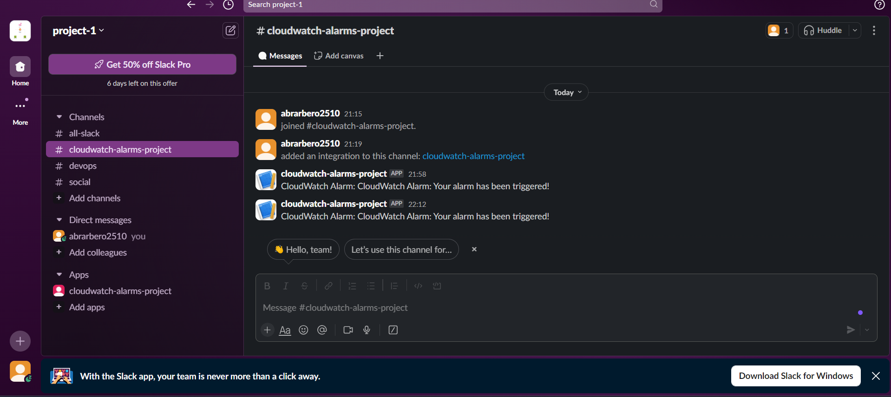

# Automating S3 File Transfer Between Buckets Using AWS Lambda (FrogTech Case)

---

## Overview
FrogTech is currently using S3 buckets to store files for internal and external parties, manually transferring files between two main buckets:
- `frogtech-us-external`
- `frogtech-us-internal`

We will automate this process using an **AWS Lambda function**, which will be triggered when files are uploaded to the external bucket, moving them to the internal bucket automatically. The Lambda function will be developed using Python's `boto3` SDK. Additionally, we will implement **Infrastructure as Code (IaC)** using **Terraform** to provision the AWS resources needed.

---

## Key Concepts

### 1. AWS Lambda Basics
AWS Lambda is a serverless computing service that lets you run code without provisioning or managing servers. 

- **Triggers**: Lambda can be triggered by various AWS services, such as S3, DynamoDB, SNS, etc.
- **Runtime**: Lambda supports multiple runtimes like Node.js, Python, Ruby, etc. For this project, we’ll use **Python**.
- **Boto3**: The official AWS SDK for Python.

### 2. Function Event
The event is the input to the Lambda function, triggered by AWS services. In this case, the S3 `PutObject` event will serve as the trigger when a file is uploaded to `frogtech-us-external`.

### 3. Function Context
The context object contains runtime information about the Lambda function. It provides details such as:
- The AWS request ID for the invocation.
- The function name and version.
- Remaining time before timeout.

### 4. Function Environment Variables
Environment variables are key-value pairs that can be used to pass configuration settings to the Lambda function. For example, you might store the name of the destination bucket (`frogtech-us-internal`) as an environment variable.

### 5. Layers
Layers are a way to package and deploy additional code and dependencies alongside your Lambda function. They can help reduce the size of your deployment package and facilitate code reuse across multiple Lambda functions.

### 6. Synchronous vs. Asynchronous Invocation
- **Synchronous Invocation**: The caller waits for the function to process the event and return a response (e.g., API Gateway triggering a Lambda).
- **Asynchronous Invocation**: The caller invokes the function but does not wait for it to complete (e.g., S3 event notifications).

---

## Diagram

.svg)
.svg)
---


# Steps to Update Your Lambda Function

## 1. Edit the Python File
Make the necessary changes to your `lambda_function.py`.

## 2. Repackage the Lambda Function

1. Open your terminal or command prompt.
2. Navigate to the directory where your `lambda_function.py` is located.
3. create a new ZIP file that includes your updated Python script. For example:

    ```bash
    Compress-Archive -Path lambda_function.py -DestinationPath lambda_function.zip
    ```

## 3. Upload the ZIP File to S3
Use the AWS CLI to upload the newly created ZIP file back to your S3 bucket:

```bash
aws s3 cp lambda_function.zip s3://frogtech-us-external/
   ```

# Complete Flow

1. **CloudWatch Alarm**:
   - **Purpose**: Monitors metrics (like high CPU usage) for your AWS resources.
   - **Setup**: 
     - Go to the CloudWatch console.
     - Create a new alarm for your desired metric (e.g., CPU utilization).
     - Set the threshold and define what action to take when the threshold is breached (e.g., send a notification to an SNS topic).

2. **SNS Topic**:
   - **Purpose**: Receives notifications from CloudWatch alarms.
   - **Setup**:
     - Create an SNS topic in the SNS console.
     - Subscribe the Lambda function to this topic so that it can receive notifications.
     - In the CloudWatch alarm settings, configure the action to publish to this SNS topic when the alarm state is triggered.

3. **Lambda Function**:
   - **Purpose**: Receives the SNS notification and forwards it to Slack using a webhook.
   - **Setup**:
     - Create a new Lambda function in the AWS Lambda console.
     - Use the following sample code to handle the SNS notification and send a message to Slack:

## Result



---
 ## Conclusion
By implementing this automation solution, FrogTech will significantly reduce manual overhead and improve efficiency in file management between their S3 buckets. The provided Terraform configuration lays out the necessary infrastructure, while the Lambda function will handle the actual file transfer process.


